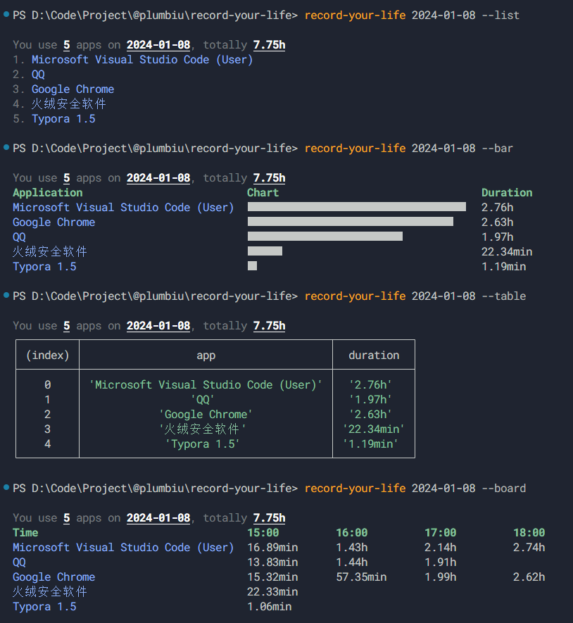
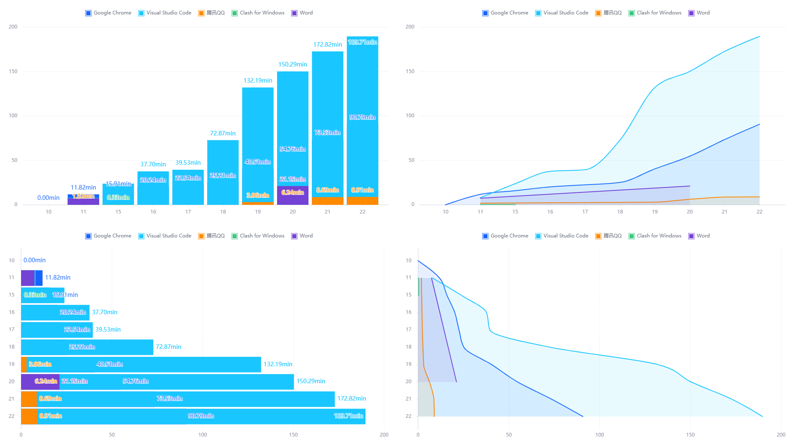

# record-your-life

> 记录你的 windows 应用使用时间

> [!NOTE]  
> 0.1.0 之前的版本计时有问题，建议停掉计划任务，安装最新版本
> 0.2.0 之后支持命令行一键自启动





# 安装

1. npm 安装

```bash
npm install record-your-life -g
```

2. 设置文件存储路径

运行命令：

```bash
record-your-life set STORAGE_PATH
```

> 如果不设置的话，默认会存储在 `npm` 全局包安装的路径

3. windows 自启动

运行命令：

```bash
record-your-life init
```

运行后，重启即可

> 默认情况下，`record-your-life` 5min 中会进行写入操作，可以在 `init` 后面添加参数，例如 `record-your-life init 10000` 10s 进行一次写入

> [!NOTE]
> 如果希望断电可以使用，请 **右键此电脑 -> 管理 -> 任务计划程序 -> 任务计划程序库 -> 找到名称为 RecordYourLife 的任务 -> 在条件一栏中将 "只有在计算机使用交流电源..." 取消掉**

# 使用

> [!NOTE]  
> 时间日期应以 `YYYY-MM-DD` 格式，例如 `2024-01-08`，而不是 `2024-1-8`，如果未填入时间时期，则默认今天

## 终端打印

```bash
record-your-life 2024-01-08 --list
record-your-life 2024-01-08 --bar
record-your-life 2024-01-08 --table
record-your-life 2024-01-08 --board
```

## 网页

```bash
record-your-life 2024-01-08 --web
```

## --detail

打印 `0ms` 的程序

```bash
record-your-life 2024-01-08 --list --detail
record-your-life 2024-01-08 --bar --detail
record-your-life 2024-01-08 --table --detail
record-your-life 2024-01-08 --board --detail
```

## --help

```txt
Usage:
  $ record-your-life [date]

Commands:
  set <storagePath>
  <date>
  init [timer]       init record your life

For more info, run any command with the `--help` flag:
  $ record-your-life set --help
  $ record-your-life --help
  $ record-your-life init --help

Options:
  --table     Table format of usage
  --bar       Bar chat format of usage
  --board     Board chat format of usage
  --web       Start web server
  --list      List of apps
  --detail    Show the unused apps
  -h, --help  Display this message
```
